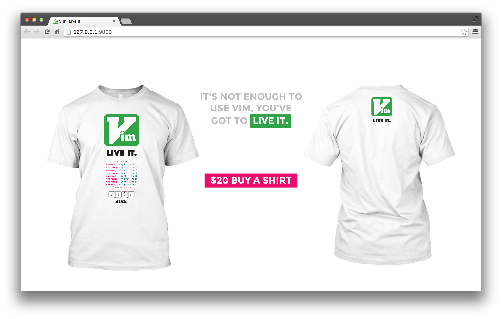

Vim. Live It. Campaign Site
===========================

It's not enough to use vim, you've got to live it.

This is a micro campaign splash page for swag based on [Tyler Cipriani](http://www.tylercipriani.com)'s
[Vim. Live It.](https://github.com/thcipriani/vim-live-it) graphic.

Live at <http://vim.ksmith.io>

## Quickstart
```
## building / running locally
$ make {build|run}

## deploying latest master to dokku
$ git push dokku master
```

## Dokku Setup
```
## assuming ~/.ssh/config has dokku.me pointing at your dokku box

## create new application
$ ssh -t dokku@dokku.me apps:create vim.ksmith.io

## set custom domain name
$ ssh -t dokku@dokku.me domains:add vim.ksmith.io vim.ksmith.io

## add git remote
$ git remote add dokku dokku@dokku.me:vim.ksmith.io
```

## le screenshot


